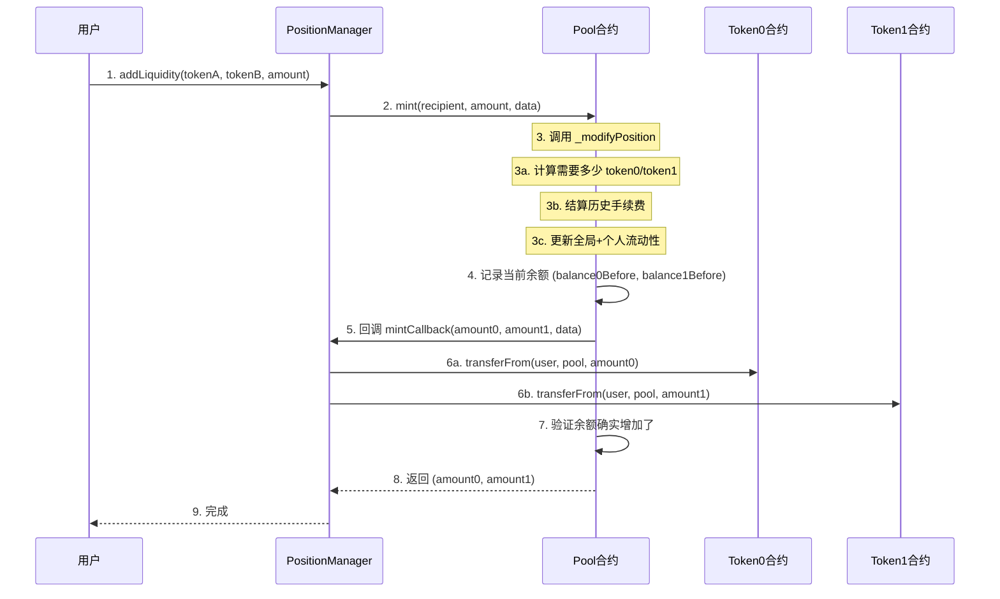
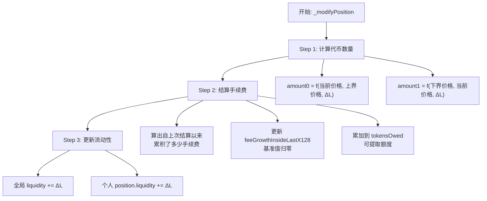
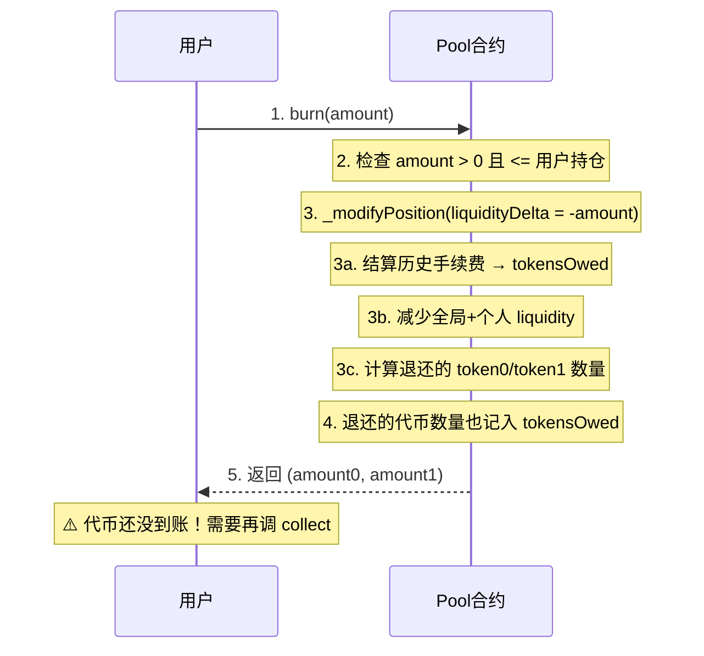
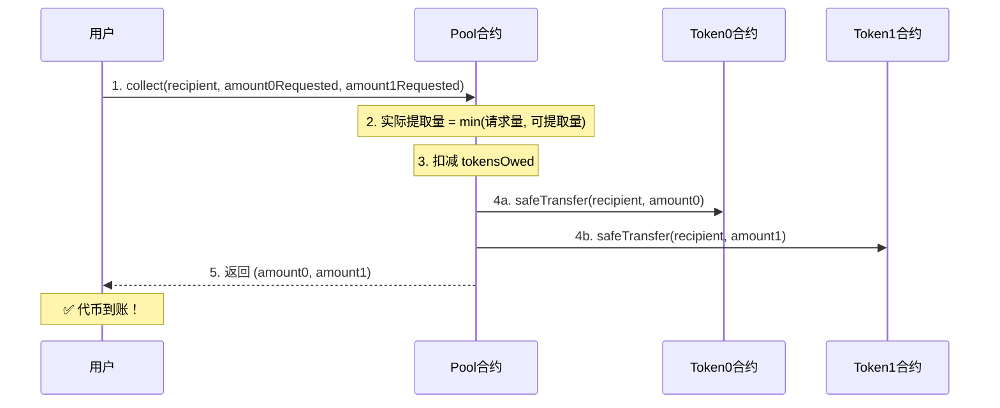

# Pool 合约：Liquidity、mint 与 _modifyPosition 详解

## 一、Liquidity（流动性）到底是什么？

### 1.1 类型与范围

```solidity
uint128 public liquidity;  // 无符号 128 位整数
// 范围：0 ~ 340,282,366,920,938,463,463,374,607,431,768,211,455
```

### 1.2 直觉理解

把 Pool 想象成一个**水池**：

| 概念 | 类比 | 含义 |
|------|------|------|
| liquidity (L) | 水池的宽度 | L 越大，同样的价格变动需要更多代币 |
| sqrtPriceX96 | 水面的位置 | 当前价格 |
| token0/token1 | 左边/右边的水量 | 池子中的代币数量 |

**一句话**：L 衡量的是"价格变动 1 个单位时，需要交换多少代币"。L 越大 → 滑点越小 → 交易体验越好。

### 1.3 L 描述的是"区间"还是"某个点"？

**L 描述的是一个价格区间内的流动性浓度，不是某个 tick 点上的值。**

```
你的池子有固定区间 [tickLower, tickUpper]
L 就是这整个区间内"铺了多厚的流动性"

类比：
  区间 = 一条马路（从 tickLower 到 tickUpper）
  L    = 马路上铺的沥青厚度
  沥青越厚（L 越大），马路越耐用（交易滑点越小）
```

tick 是价格的离散刻度（`price = 1.0001^tick`），但 L 不是某个 tick 上的值，而是**整个区间共享同一个 L**。

### 1.4 为什么是 x * y = L² 而不是 x * y = k？

**Uniswap V2**：
```
x * y = k      （k 是常数）
```

**Uniswap V3** 改写为：
```
x * y = L²     （L = sqrt(k)）
```

**这不只是换个写法，L 有一个关键优势：可以线性叠加。**

#### 先看 k 为什么不能相加

```
Uniswap V2:  x × y = k

Alice 存入: x_a=100, y_a=100  →  k_a = 10000
Bob   存入: x_b=100, y_b=100  →  k_b = 10000

合并后池子: x=200, y=200  →  k = 40000

k_a + k_b = 20000 ≠ 40000  ❌  k 不能相加！
```

因为 k = x × y 是**乘法关系**，合并后的乘积不等于各自乘积的和。

#### 换成 L = √k 就可以了

```
同样的例子：
Alice: L_a = √(10000) = 100
Bob:   L_b = √(10000) = 100

合并后: L = √(40000) = 200

L_a + L_b = 100 + 100 = 200 = L  ✅  L 可以相加！
```

#### 为什么？数学推导（很短）

```
V2 公式: x × y = k，其中 L = √k

所以: x × y = L²

在同一个价格 P 下（P = y/x），可以推出：
  x = L / √P      ← x 和 L 是线性关系！
  y = L × √P      ← y 和 L 也是线性关系！

所以当 Alice 和 Bob 合并：
  x_total = x_a + x_b = L_a/√P + L_b/√P = (L_a + L_b)/√P
  y_total = y_a + y_b = L_a×√P + L_b×√P = (L_a + L_b)×√P

令 L_total = L_a + L_b，代入验证：
  x_total × y_total = (L_total/√P) × (L_total×√P) = L_total²  ✅
```

**核心**：因为 `x = L/√P` 和 `y = L×√P`，代币数量和 L 是**线性关系**。线性的东西自然可以相加。

#### 最直观的类比

```
想象并联水管：

  水管截面积 = L（流动性）
  水压      = 价格

  A 接了一根截面 100 的水管
  B 接了一根截面 100 的水管
  并联之后 = 截面 200 的水管  ← 直接相加！

  但如果你用 k = 截面积² 来衡量：
  A: k=10000,  B: k=10000,  合并: k=40000 ≠ 20000
  → k 不能相加，因为它是面积的平方，不是线性量
```

#### 对应到代码

```solidity
// 因为 L 可以线性相加，所以代码里直接 ±
liquidity = LiquidityMath.addDelta(liquidity, params.liquidityDelta);

// 如果用 k，就得: k_new = (√k_old ± ΔL)²  ← 复杂得多
```

这就是 Uniswap V3 选择用 L 而不是 k 的根本原因：**让多个 LP 的流动性可以简单叠加**。

### 1.5 数学公式（选读）

在价格区间 [Pa, Pb] 内，给定流动性 L：

```
需要的 token0 数量：Δx = L × (1/√Pa - 1/√Pb)
需要的 token1 数量：Δy = L × (√Pb - √Pa)
```

这两个公式正好对应 1.4 中推导出的 `x = L/√P` 和 `y = L×√P`，只是应用到了一个价格区间上。

对应代码中的：
```solidity
amount0 = SqrtPriceMath.getAmount0Delta(sqrtPriceX96, sqrtPriceUpper, L);
amount1 = SqrtPriceMath.getAmount1Delta(sqrtPriceLower, sqrtPriceX96, L);
```

### 1.6 实际值举例

```
假设：
  存入 1 ETH (1e18 wei) + 2000 USDC (2000e6，USDC 6位精度)
  价格区间覆盖当前价格

  L ≈ sqrt(1e18 × 2000e6) ≈ 4.47 × 10^13

实际项目中 L 通常是 10^12 ~ 10^20 量级的大数
```

---

## 二、多 LP 区间重叠与 L 的叠加

### 2.1 真实 Uniswap V3：每个 LP 可以选不同区间

```
价格轴:  100    200    300    400    500

Alice:   |=============|                    L_a = 100，区间 [100, 300]
Bob:              |=============|           L_b = 150，区间 [200, 400]
Carol:                     |=========|      L_c = 80， 区间 [300, 500]

实际生效的 L（按区间叠加）：

[100,200): L = 100            （只有 Alice）
[200,300): L = 100+150 = 250  （Alice + Bob 重叠）
[300,400): L = 150+80 = 230   （Bob + Carol 重叠）
[400,500): L = 80             （只有 Carol）
```

在重叠部分 L 直接相加，不重叠部分各自生效。所以交易在不同价格区域会遇到不同的 L → 不同的滑点。

### 2.2 每个 tick 的 L 都可能不同

因为每个 LP 的价格区间都不同，理论上**每个 tick 边界处的 L 都可能不同**。

Uniswap V3 用了一个巧妙的方式存储：不存每个 tick 的绝对 L 值，而是在 tick 边界存 **ΔL（净变化量）**：

```
tick 100: ΔL = +100  （Alice 的区间从这里开始，进入时 L += 100）
tick 200: ΔL = +150  （Bob 的区间从这里开始）
tick 300: ΔL = -100  （Alice 的区间到这里结束，离开时 L -= 100）
tick 400: ΔL = -150  （Bob 的区间到这里结束）

swap 经过时，遇到 tick 边界就累加 ΔL：
  价格在 [100,200): L = 0+100 = 100
  价格在 [200,300): L = 100+150 = 250
  价格在 [300,400): L = 250-100 = 150
  价格在 [400,∞):   L = 150-150 = 0
```

这就是 Uniswap V3 源码里有 `tick.liquidityNet`（ΔL）和 `tick bitmap`（快速查找下一个有 ΔL 的 tick）的原因。

### 2.3 我们的简化版：所有人共享同一个区间

```
我们的 Pool：

  tickLower 和 tickUpper 是 immutable（创建时固定）
  所有 LP 都在 [tickLower, tickUpper] 这同一个区间内提供流动性

Alice:   |=========================|    L_a = 100
Bob:     |=========================|    L_b = 150
         tickLower              tickUpper

全局 L = 100 + 150 = 250（永远完全重叠，直接加）
```

这就是为什么我们的代码只需要一个 `uint128 liquidity` 就够了，不需要按 tick 维护不同的 L。

### 2.4 对比总结

| | Uniswap V3 | 我们的简化版 |
|---|---|---|
| LP 选择区间 | 每个 LP 自由选 [tickLower, tickUpper] | 所有 LP 共享池子创建时的固定区间 |
| L 的存储 | 每个 tick 边界记录 ΔL（进入/离开） | 一个全局变量 `liquidity` |
| 跨 tick 逻辑 | swap 穿越 tick 时要更新 L | 不需要，价格在区间内 L 不变 |
| 复杂度 | 高（tick bitmap、跨 tick 循环） | 低（单一区间，一次计算） |

**简化的代价**：资本效率低一些（不能精确选择价格范围），但代码简单很多，适合学习核心逻辑。

---

## 三、mint 完整流程

### 3.1 流程图



### 3.2 为什么用回调模式？

```
❌ 普通模式（不安全）：
  1. Pool 直接调 transferFrom 从用户扣钱
  → 问题：Pool 需要用户 approve 给 Pool
  → 但 Pool 地址在创建前才知道，approve 流程复杂

✅ 回调模式（Uniswap 的做法）：
  1. Pool 先做完状态更新
  2. Pool 回调 PositionManager："你该给我转 X 个代币了"
  3. PositionManager 执行 transferFrom
  4. Pool 验证余额确实增加了

好处：
  - 用户只需要 approve 给 PositionManager（一个已知的、固定的合约地址）
  - Pool 不需要任何 approve 权限
  - 安全：如果代币没到账，整个交易回滚
```

---

## 四、mint 函数参数详解

```solidity
function mint(
    address recipient,  // 谁获得 LP 持仓？（通常就是用户自己的地址）
    uint128 amount,     // 要添加多少流动性（就是 ΔL 值，不是代币数量！）
    bytes calldata data // 透传数据，传给回调函数（通常包含 payer 地址）
) external returns (
    uint256 amount0,    // 实际需要的 token0 数量（wei）
    uint256 amount1     // 实际需要的 token1 数量（wei）
)
```

### 关键点

| 参数 | 类型 | 易混淆点 |
|------|------|---------|
| `amount` | uint128 | ⚠️ 这是 ΔL（流动性增量），**不是代币数量**！代币数量是根据 ΔL 和价格区间算出来的 |
| `recipient` | address | 持仓归属者。可以给别人添加流动性（recipient ≠ msg.sender） |
| `data` | bytes | 任意数据，Pool 不解析，原样传给 mintCallback |
| `amount0/1` 返回值 | uint256 | 根据当前价格和区间计算出的实际代币需求量 |

### amount 是用户输入的吗？

**不是！** 用户在前端输入的是代币数量，PositionManager 反算出 ΔL。

```
用户在前端看到的：
  ┌─────────────────────┐
  │ 存入 ETH：[  1.0  ] │  ← 用户输入代币数量
  │ 存入 USDC：[ 2000 ] │  ← 或者只输一个，另一个自动算
  │ 价格区间：1800~2200  │
  └─────────────────────┘

调用链：
  用户输入代币数量
    → PositionManager 用 LiquidityAmounts 库反算 ΔL
      → pool.mint(recipient, ΔL, data)
        → _modifyPosition 用 ΔL 正向算出代币量
```

反算公式（LiquidityAmounts 库）：
```
ΔL = amount0 / (1/√P_current - 1/√P_upper)
或
ΔL = amount1 / (√P_current - √P_lower)
```

### amount 是 LP 自己的 ΔL，不是池子的总 L

```
Alice 说："我要存 1 ETH"
  → PositionManager 反算出 ΔL = 500
  → 调用 pool.mint(alice, ΔL=500, data)

Pool 内部（_modifyPosition）：
  liquidity += 500           // 池子总 L 增加 500（从 1000 → 1500）
  position.liquidity += 500  // Alice 个人的 L 增加 500（从 0 → 500）
```

所以 mint 的 amount 就是这个 LP 本次注入的增量（ΔL），不是池子的总 L。

---

## 五、_modifyPosition 逐行解析

```solidity
function _modifyPosition(
    ModifyPositionParams memory params
    // params.owner:          持仓所有者地址
    // params.liquidityDelta: 流动性变化量（正=添加，负=移除）
) private returns (int256 amount0, int256 amount1)
```

### 5.1 步骤拆解



### 5.2 Step 1：计算代币数量

```solidity
// 当前价格到上界之间，需要多少 token0
amount0 = SqrtPriceMath.getAmount0Delta(
    sqrtPriceX96,                        // 当前价格的平方根（区间起点）
    TickMath.getSqrtPriceAtTick(tickUpper), // 上界价格的平方根（区间终点）
    params.liquidityDelta                  // 流动性变化量（L 值）
);

// 下界到当前价格之间，需要多少 token1
amount1 = SqrtPriceMath.getAmount1Delta(
    TickMath.getSqrtPriceAtTick(tickLower), // 下界价格的平方根（区间起点）
    sqrtPriceX96,                        // 当前价格的平方根（区间终点）
    params.liquidityDelta                  // 流动性变化量（L 值）
);
```

#### 为什么需要三个参数（不是只要 L 和 P 就够了）？

公式是：`Δx = L × (1/√P_current - 1/√P_upper)`

需要**两个价格**，不是一个。因为 LP 提供的是**一段区间**的流动性，需要知道区间的起点和终点：

```
问：这条马路（区间）需要多少沥青（代币）？

❌ 只知道马路宽度（L）和起点位置（P_current）
   → 不够！不知道马路有多长

✅ 知道马路宽度（L）+ 起点（P_current）+ 终点（P_upper）
   → 宽度 × 长度 = 沥青量
```

三个参数缺一不可：
- `sqrtPriceX96` — 区间起点（当前价格）
- `getSqrtPriceAtTick(tickUpper)` — 区间终点（上界价格）
- `liquidityDelta` — L 值（浓度/宽度）

#### L 从哪来？它在区间内不是不固定的吗？

这里容易混淆两个层面的 L：

```
视角 1：单个 LP 添加流动性（mint 在算的事情）
  Alice 说："我要注入 L=100 的流动性"
  这个 L=100 在她的整个区间内是【均匀的、固定的】
  → 这就是 mint(amount=100) 中的 amount

视角 2：多个 LP 叠加后，池子在不同 tick 的总 L
  这个 L 在不同 tick 确实可能不同（因为不同 LP 的区间不同）
  → 这是第二章讲的"每个 tick 的 L 可能不同"
```

具体例子：

```
Alice 提供 L=100，区间 [100, 300]
Bob  提供 L=150，区间 [200, 400]

Alice 自己的 L：在 [100,300] 内处处 = 100  ← 固定的！可以直接算代币量
Bob 自己的 L：  在 [200,400] 内处处 = 150  ← 也是固定的！

但池子的总 L（叠加结果）：
  [100,200) = 100       ← 只有 Alice
  [200,300) = 250       ← Alice + Bob
  [300,400) = 150       ← 只有 Bob
  → 总 L 不固定，但那是叠加的结果，跟 mint 计算无关
```

所以 mint 的计算是完全合理的：

```
mint(amount = 100)  // Alice 要注入 L=100

_modifyPosition 里：
  amount0 = getAmount0Delta(P_current, P_upper, L=100)  // 用她自己固定的 L
  amount1 = getAmount1Delta(P_lower, P_current, L=100)

  这里的 L=100 是 Alice 自己要注入的量，在她的区间内均匀分布
  → 可以直接算出她需要存多少 token0 和 token1
```

#### 为什么 [当前, 上界] 算的是 token0，[下界, 当前] 算的是 token1？

要从"交易会发生什么"来理解。LP 存的代币，是给未来交易者"买走"用的：

```
price = token1 / token0（1个 token0 值多少 token1）

场景 1：价格从 2000 涨到上界 2200（有人在买 token0）
  交易者：给池子 token1，拿走 token0
  → 池子在 [当前, 上界] 必须提前储备 token0 等着被买走
  → LP 添加流动性时，这段区间需要存入 token0 ✅

场景 2：价格从 2000 跌到下界 1800（有人在卖 token0）
  交易者：给池子 token0，拿走 token1
  → 池子在 [下界, 当前] 必须提前储备 token1 等着被买走
  → LP 添加流动性时，这段区间需要存入 token1 ✅
```

图示：

```
             价格下跌方向                价格上涨方向
                ←                           →
  [tickLower ──────── 当前价格 ──────── tickUpper]
  |    储备 token1   |      储备 token0        |
  | （价格跌时被买走） |   （价格涨时被买走）     |
  |                  |                         |
  |  getAmount1Delta |  getAmount0Delta        |
  | (P_lower→P_cur)  |  (P_cur→P_upper)       |
```

一句话总结：**价格往哪个方向走，就需要储备那个方向会被买走的代币。**

### 5.3 Step 2：结算手续费

#### feeGrowthGlobal0X128 和 feeGrowthGlobal1X128 详解

**数据类型**：`uint256`（Pool.sol 第 37-38 行声明）

**什么时候变化**：在 swap 函数中（Part 4 要写的），每次交易收取手续费时更新：

```solidity
// swap 函数中：
uint256 feeAmount = ...;  // 本次交易的手续费
feeGrowthGlobal0X128 += FullMath.mulDiv(feeAmount, FixedPoint128.Q128, liquidity);
//                       手续费 × 2^128 / 当前总流动性
//                       = 每单位流动性分到多少手续费（放大 2^128 倍保留精度）
```

**它代表什么**：这是整个池子的全局值，是"每单位流动性的累计手续费"，**不是代币数量，也不是总额**。

```
类比：
  feeGrowthGlobal0X128 = 公司成立以来的「每股累计分红」（全局值，所有人看到的一样）
  不是公司发出的分红总额
  也不是某个人的分红

  你能分到多少 = 每股累计分红 × 你持有的股数（你的 L）
```

#### 这些变量是代币数量吗？

| 变量 | 是代币数量吗 | 实际含义 | 单位 |
|------|-------------|---------|------|
| `feeGrowthGlobal0X128` | ❌ | 每单位 L 的累计手续费 × 2^128 | token0 × 2^128 / L |
| `feeGrowthInside0LastX128` | ❌ | 同上，记录"你上次结算时"的快照 | token0 × 2^128 / L |
| `tokensOwed0` | ✅ | 池子欠你的，可以通过 collect 提取 | token0 数量（wei） |
| `amount0` | ✅ | 需要存入/退出的代币数量 | token0 数量（wei） |
| `liquidity` | ❌ | 流动性浓度 | 无量纲（L 值） |

```
还原过程：
  feeGrowthGlobal0X128（不是代币数量）
    → 减去基准值，得到差值（还不是代币数量）
      → × 你的 L / 2^128（现在是代币数量了！）
        → 存入 tokensOwed0（是代币数量）
          → collect 转给你（真的到账了）
```

在我们的简化版中，一个 Pool = 一个交易对 + 一个固定区间 + 一个固定 fee，所以这个全局值代表的就是这个池子所有交易产生的、按每单位 L 平摊的累计手续费。

#### 为什么要 X128？

Solidity 没有小数，直接除法会丢失精度：

```
问题：
  池子总流动性 L = 1000
  本次手续费 = 1 个代币
  每单位 L 分到：1 / 1000 = 0.001  ← Solidity 算出来是 0！

解决：先乘以 2^128，再除
  1 × 2^128 / 1000 = 340282366920938463463374607431768211  ← 保留了精度！

  等真正要提取时，再除以 2^128 还原：
  大整数 × 你的L / 2^128 = 实际代币数量

X128 = "乘了 2^128"，是定点数精度技巧
类似于：用"分"记账避免小数（1.23元 → 123分）
只不过放大倍数是 2^128 而不是 100
```

#### 结算手续费的代码

```solidity
// 手续费公式：你能分到的手续费 = (全局累计 - 你上次的基准值) × 你的流动性 / 2^128
uint128 tokensOwed0 = uint128(
    FullMath.mulDiv(
        feeGrowthGlobal0X128 - position.feeGrowthInside0LastX128,  // 差值 = 新增的每单位手续费
        position.liquidity,                                         // 你的流动性份额
        FixedPoint128.Q128                                         // 除以 2^128 还原精度
    )
);
```

**注意：feeGrowthGlobal0X128 不是当前 LP 的分红！** 它是全局值，所有人看到的同一个数。每个 LP 能领多少，取决于各自的基准值不同：

```
举例：
  全局累计：feeGrowthGlobal0X128 = 500（×2^128）

  Alice 在第 100 笔交易时加入，当时全局累计 = 300
    position.feeGrowthInside0LastX128 = 300
    差值 = 500 - 300 = 200  → Alice 能领 200 × L_alice / 2^128

  Bob 在第 200 笔交易时加入，当时全局累计 = 450
    position.feeGrowthInside0LastX128 = 450
    差值 = 500 - 450 = 50   → Bob 只能领 50 × L_bob / 2^128

  同一个全局值，不同的基准值 → 不同的分红结果
```

#### tokensOwed 是什么？

```
owed = "欠的、应付的"

tokensOwed0 = 池子欠你的 token0 数量（你可以提取但还没提取的）

包含两部分：
  1. burn 退出流动性时退还的本金
  2. 累计的手续费分红

它只是一个「记账值」，真正拿到代币要调 collect 函数（Part 3 要写的）
```

#### 为什么 mint 时要结算手续费？新流动性还没产生交易啊

如果是第一次 mint，手续费确实是 0。但 `_modifyPosition` 不只处理"第一次添加"：

```
场景 1：Alice 第一次 mint（ΔL=100）
  position.liquidity = 0（没有历史持仓）
  feeGrowthGlobal0X128 = 0
  feeGrowthInside0LastX128 = 0
  差值 = 0 - 0 = 0  → tokensOwed = 0  ✅ 确实是 0，没问题

场景 2：Alice 第二次 mint（追加 ΔL=50）
  position.liquidity = 100（之前已有持仓）
  期间发生了很多 swap，feeGrowthGlobal0X128 涨到了 500
  feeGrowthInside0LastX128 还是上次的值 = 0
  差值 = 500 - 0 = 500  → 有手续费要结算！

  如果不在这里结算会怎样？
    liquidity 从 100 变成 150
    下次结算时用 150 去算 → 多出来的 50 也分到了"它加入之前"的手续费 → 不公平！

场景 3：burn（移除流动性，liquidityDelta 为负数）
  也要先结算手续费，否则移除后 liquidity 变小，手续费就少算了
```

**一句话**：`_modifyPosition` 是 mint 和 burn 共用的函数，每次持仓变化前都必须先结算历史手续费，否则新旧流动性混在一起，手续费分配就不公平了。

### 5.4 Step 3：更新流动性

```solidity
// 更新基准值（"我已经结算到最新了"）
position.feeGrowthInside0LastX128 = feeGrowthGlobal0X128;
position.feeGrowthInside1LastX128 = feeGrowthGlobal1X128;

// 累加到可提取额度（记账，不是真的转代币）
position.tokensOwed0 += tokensOwed0;
position.tokensOwed1 += tokensOwed1;

// 更新流动性
liquidity = LiquidityMath.addDelta(liquidity, params.liquidityDelta);
position.liquidity = LiquidityMath.addDelta(position.liquidity, params.liquidityDelta);
```

**为什么先结算手续费，再更新流动性？**
```
顺序很重要！

如果先更新流动性再结算：
  添加 L=100 → position.liquidity 变成 200
  → 用新的 200 去算手续费 → 多算了！（那 100 是刚加的，还没产生手续费）

正确顺序：
  1. 用旧的 position.liquidity=100 算手续费 ✅
  2. 再把 liquidity 更新为 200
```

---

## 六、mint 函数逐行解析

```solidity
function mint(
    address recipient,
    uint128 amount,
    bytes calldata data
) external override returns (uint256 amount0, uint256 amount1) {

    // 1. 不允许添加 0 流动性
    require(amount > 0, "Mint amount must be greater than 0");

    // 2. 调用核心函数：计算代币需求 + 结算手续费 + 更新流动性
    (int256 amount0Int, int256 amount1Int) = _modifyPosition(
        ModifyPositionParams({
            owner: recipient,
            liquidityDelta: int128(amount)  // uint128 → int128，正数 = 添加
        })
    );
    // int256 → uint256（添加流动性时一定是正数，所以安全）
    amount0 = uint256(amount0Int);
    amount1 = uint256(amount1Int);

    // 3. 回调模式 —— 先记录当前余额
    uint256 balance0Before;
    uint256 balance1Before;
    if (amount0 > 0) balance0Before = balance0();
    if (amount1 > 0) balance1Before = balance1();

    // 4. 告诉调用方（PositionManager）："你该转代币给我了"
    IMintCallback(msg.sender).mintCallback(amount0, amount1, data);

    // 5. 验证代币到账（如果没到账，整个交易回滚）
    if (amount0 > 0)
        require(balance0Before.add(amount0) <= balance0(), "M0");
    if (amount1 > 0)
        require(balance1Before.add(amount1) <= balance1(), "M1");

    // 6. 发出事件，前端可以监听
    emit Mint(msg.sender, recipient, amount, amount0, amount1);
}
```

### 6.1 balance0() 详解

```solidity
function balance0() private view returns (uint256) {
    (bool success, bytes memory data) = token0.staticcall(
        abi.encodeWithSelector(IERC20.balanceOf.selector, address(this))
    );
    require(success && data.length >= 32);
    return abi.decode(data, (uint256));
}
```

#### 逐行拆解

```
1. IERC20.balanceOf.selector
   = balanceOf 函数的 4 字节标识符
   = keccak256("balanceOf(address)") 的前 4 字节 = 0x70a08231
   每个 Solidity 函数都有唯一的 4 字节 selector，用来识别调用哪个函数

2. abi.encodeWithSelector(0x70a08231, address(this))
   = 把函数选择器 + 参数编码成一段 bytes
   = "调用 balanceOf，参数是 Pool 自己的地址"
   类比 JS：JSON.stringify({ method: 'balanceOf', args: [poolAddress] })

3. token0.staticcall(...)
   = 向 token0 合约发起只读调用（不修改任何状态）
   = staticcall 是底层指令，比普通调用更安全（保证不会改状态）
   返回 (bool success, bytes memory data)

4. abi.decode(data, (uint256))
   = 把返回的 bytes 解码成 uint256 = Pool 持有的 token0 余额
```

其实也可以直接写（参考项目选择底层方式，更省 gas）：
```solidity
// 等价的简单写法（但稍微贵一点 gas）：
uint256 bal = IERC20(token0).balanceOf(address(this));
```

#### balance0 和 amount0 的区别

```
balance0() = Pool 合约的 token0 钱包余额（pool 账户上一共有多少 token0）
amount0    = 本次操作需要的 token0 数量（这次 mint 需要多少 token0）

类比：
  balance0 = 你银行卡余额（总共有多少钱）
  amount0  = 你本次转账金额（这次要转多少钱）
```

#### 两次 balance0() 调用返回值不同

```
时间线：

  ① balance0Before = balance0()     // 比如 = 10000
     ↓
  ② mintCallback(...)               // PositionManager 转了 100 token0 进来
     ↓
  ③ balance0()                      // 现在 = 10100（增加了！）
     ↓
  ④ require(10000 + 100 <= 10100)   // 验证通过 ✅

如果 PositionManager 没转钱（或转少了）：
  ③ balance0() = 10000（没变）
  ④ require(10000 + 100 <= 10000)   // 失败！整个交易回滚 ❌
```

#### token0 多转了，token1 也需要多转吗？

**不需要。** token0 和 token1 是两个完全独立的代币合约，独立验证：

```
比如需要 100 token0 + 200 token1：
  转了 150 token0 + 200 token1 → ✅（多转的 50 留在池子里，算捐赠）
  转了 100 token0 + 100 token1 → ❌（token1 不够，交易回滚）
```

### 6.2 IMintCallback(msg.sender) 详解

```solidity
IMintCallback(msg.sender).mintCallback(amount0, amount1, data);
```

#### IMintCallback(msg.sender) 是类还是方法？

**都不是！是类型转换（强制转型）。**

```
拆解成两步：

1. IMintCallback(msg.sender)
   = 把 msg.sender（address 类型）转型为 IMintCallback 接口类型
   = 告诉编译器："这个地址上的合约实现了 IMintCallback 接口"
   类比 TypeScript：(msg.sender as IMintCallback)

   ⚠️ msg.sender 不是"构造函数参数"，而是"要转型的地址"

2. .mintCallback(amount0, amount1, data)
   = 对这个地址发起外部调用
```

#### 为什么 interface 也能调用？

```
Solidity 中 interface 的作用 = "我知道这个地址上有哪些函数"

编译器根据 interface 定义：
  1. 知道 mintCallback 的参数类型和返回类型
  2. 生成正确的 ABI 编码
  3. 向 msg.sender 发起外部调用

本质上等价于底层调用：
  (bool success, ) = msg.sender.call(
      abi.encodeWithSelector(
          IMintCallback.mintCallback.selector,
          amount0, amount1, data
      )
  );
  // 跟 balance0() 里的 staticcall 原理一样！
  // interface 只是让你不用手写这些底层代码
```

#### mintCallback 的真实实现在哪？

```
接口定义在：
  contracts/MetaNodeSwap/interfaces/IPool.sol（第 9-18 行）

真实实现在 PositionManager 合约（Step 6 要写的）：

  contract PositionManager is IMintCallback {
      function mintCallback(
          uint256 amount0Owed,
          uint256 amount1Owed,
          bytes calldata data
      ) external override {
          address payer = abi.decode(data, (address));
          IERC20(token0).transferFrom(payer, msg.sender, amount0Owed);
          IERC20(token1).transferFrom(payer, msg.sender, amount1Owed);
      }
  }

调用链：
  Pool.mint()
    → IMintCallback(msg.sender).mintCallback(...)
      → msg.sender 就是 PositionManager
        → PositionManager.mintCallback() 被执行
          → transferFrom 把用户的代币转到 Pool

  如果 msg.sender 没有实现 mintCallback → 交易直接失败回滚
```

#### 不需要 await 吗？怎么知道成功还是失败？

**Solidity 没有 async/await，所有外部调用都是同步的。**

```
Solidity vs JavaScript：

JS：  const result = await fetch(url)                    // 异步，需要 await
Sol： IMintCallback(msg.sender).mintCallback(...)        // 同步，直接执行

原因：以太坊交易是原子性的
  - 一个交易内的所有代码按顺序执行，没有并发
  - 不存在"等回调结果"的问题，调用完了才执行下一行
  - 所以不需要 await
```

成功/失败的处理取决于调用方式：

```
1. 高级调用（mint 里用的）：
   IMintCallback(msg.sender).mintCallback(amount0, amount1, data);
   → 如果失败，自动 revert 整个交易（包括之前所有状态修改全部回滚）
   → 不需要手动检查，失败了就像从没执行过一样
   → 类似 JS 中不加 try-catch 的 throw：直接崩

2. 底层调用（balance0 里用的）：
   (bool success, bytes memory data) = token0.staticcall(...);
   → 失败不会自动 revert，而是返回 success = false
   → 需要手动检查：require(success)
   → 类似 JS 中 fetch 返回 { ok: false }
```

mint 函数的执行流程：

```
执行到 IMintCallback(msg.sender).mintCallback(...)
  ↓
同步跳到 PositionManager.mintCallback() 执行
  ↓
  ├── 成功：返回，继续执行下一行 require(balance0Before...)
  │
  └── 失败（比如用户余额不足、没有 approve）：
      整个交易立即 revert
      Pool 中所有状态修改全部回滚（liquidity、position 等恢复原样）
      用户的 gas 费白花了，但代币不会丢
```

---

## 七、burn 函数详解（移除流动性）

### 7.1 为什么分成 burn + collect 两步？

```
mint（添加）：一步完成，代币立即转入 Pool
burn（移除）：分两步

  burn  → 记账（"池子欠你多少代币"）→ 写入 tokensOwed
  collect → 真正转代币给你

为什么不在 burn 里直接转？
  1. 灵活：可以 burn 一部分，collect 一部分，不用一次全提
  2. 手续费也存在 tokensOwed 里，collect 统一提取（本金 + 手续费一起拿）
  3. 安全：分离状态修改和代币转移，降低重入攻击风险
```

### 7.2 burn 流程图



### 7.3 参数与代码解析

```solidity
function burn(
    uint128 amount    // 要移除的 ΔL（跟 mint 的 amount 一样是流动性增量）
) external returns (
    uint256 amount0,  // 本次退还的 token0 数量（记账值，还没转）
    uint256 amount1
)
```

```solidity
// liquidityDelta 为负数 = 移除流动性
(int256 amount0Int, int256 amount1Int) = _modifyPosition(
    ModifyPositionParams({
        owner: msg.sender,      // burn 只能移除自己的流动性
        liquidityDelta: -int128(amount)  // 负数！
    })
);

// _modifyPosition 返回负数（移除 = 池子要退给你），取反变正数
amount0 = uint256(-amount0Int);
amount1 = uint256(-amount1Int);

// 记账到 tokensOwed，不转代币
positions[msg.sender].tokensOwed0 += uint128(amount0);
positions[msg.sender].tokensOwed1 += uint128(amount1);
```

### 7.4 burn vs mint 对比

| | mint（添加） | burn（移除） |
|---|---|---|
| liquidityDelta | `+int128(amount)` 正数 | `-int128(amount)` 负数 |
| 返回值符号 | 正数（你要付多少） | 负数（池子要退多少），取反使用 |
| 代币转移 | 回调模式，立即转入 Pool | 不转代币，记账到 tokensOwed |
| owner | recipient（可以给别人） | msg.sender（只能移除自己的） |
| 后续操作 | 无 | 需要调 collect 提取代币 |

---

## 八、collect 函数详解（提取代币）

### 8.1 collect 流程图



### 8.2 参数与代码解析

```solidity
function collect(
    address recipient,          // 代币转给谁（可以不是自己）
    uint128 amount0Requested,   // 想提取多少 token0
    uint128 amount1Requested    // 想提取多少 token1
) external returns (
    uint128 amount0,            // 实际提取的 token0
    uint128 amount1             // 实际提取的 token1
)
```

```solidity
Position storage position = positions[msg.sender];

// 实际提取量 = min(请求量, 可提取量)
// 防止请求超过可提取额度
amount0 = amount0Requested > position.tokensOwed0
    ? position.tokensOwed0       // 请求太多，只给可提取的
    : amount0Requested;          // 请求合理，给请求的

// 扣减记账 + 转代币
if (amount0 > 0) {
    position.tokensOwed0 -= amount0;   // 先扣账
    TransferHelper.safeTransfer(token0, recipient, amount0);  // 再转代币
}
```

### 8.3 tokensOwed 的来源

```
tokensOwed 里的代币来自两个地方：

1. _modifyPosition 中结算的手续费（每次 mint/burn 时自动结算）
   position.tokensOwed0 += 手续费分红

2. burn 退还的本金
   positions[msg.sender].tokensOwed0 += uint128(amount0)

collect 不区分来源，统一提取
```

### 8.4 典型使用场景

```
场景 1：只提取手续费（不移除流动性）
  → burn(0)？不行，amount 必须 > 0
  → 可以 burn(1) 极小量，触发手续费结算，然后 collect 提取

场景 2：全部退出
  → burn(全部 liquidity)
  → collect(type(uint128).max, type(uint128).max)  // 请求最大值 = 全部提取

场景 3：部分退出
  → burn(一半 liquidity)
  → collect(想要的数量)  // 可以只提一部分，剩下的留在 tokensOwed 里
```

---

## 九、常见问题

### Q1：mint/burn 的 amount 参数是代币数量吗？
**不是！** amount 是 ΔL（流动性增量）。代币数量是 _modifyPosition 内部根据 ΔL 和价格区间算出来的。

### Q2：为什么 balance0Before 用 `<=` 而不是 `==`？
```solidity
require(balance0Before.add(amount0) <= balance0(), "M0");
//                                  ^^
```
用 `<=` 是因为调用方可以多转（转多了不拒绝），但不能少转。

### Q3：_modifyPosition 为什么是 private？
因为它同时被 mint 和 burn 使用（burn 传负的 liquidityDelta），不应该被外部直接调用。

### Q4：data 参数有什么用？
Pool 不解析 data，只是原样传给 mintCallback。PositionManager 通常在里面编码 payer（付款人）地址：
```solidity
// PositionManager 端
bytes memory data = abi.encode(msg.sender);  // 把真正的付款人地址传进去

// mintCallback 里解码
address payer = abi.decode(data, (address));
```
